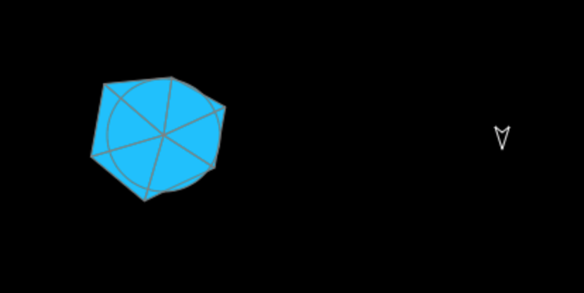

# adding rocks

In the lesson, You are going to learn some very important concepts about gaming. We are going to learn about
* Drawing circle, radians, and the magic number `PI`
* Random numbers
* While loops
* Using graphics to draw lines
* How to draw an asteroid
 
There is a lot to learn in this secion, so we will start with something really simple. We will draw a single rock to our game. Now, it won't do anything yet, and you can fly through it and you won't blow up, in fact it won't even move just yet, but we will show you how to do this next.

First, we are going to define a rock. We will add this just after the definition for the ship.

```js
	var ship;			//the actual ship
	var rock;           //our first rock

```

Next, we will add a bunch of code to draw one random rock. This might look like a lot of code, but we will make is shorter later. Add this to the `restart()` function, just after `stage.removeAllChildren();`. 

```js

        //hide anything on stage 
		stage.removeAllChildren();

		// create a rock

		rock = new createjs.Shape();
		
		var size = 40;
		var radius = 0;
		var angle = 0;

        rock.graphics.clear();
        
		// show guide circle
		rock.graphics.beginFill("DeepSkyBlue").drawCircle(0,0, size);

		rock.graphics.beginStroke("gray"); 
        rock.graphics.drawCircle(0,0, size);
        
        / start at bottom of rock
		rock.graphics.moveTo(0, size); 

		// step 1
		angle += 1.0;
		radius = size + (size / 2 * Math.random());
		rock.graphics
			.lineTo(Math.sin(angle) * radius, Math.cos(angle) * radius)
			.lineTo(0,0) // show wheel spoke
			.lineTo(Math.sin(angle) * radius, Math.cos(angle) * radius);

		// step 2
		angle += 1.0;
		radius = size + (size / 2 * Math.random());
		rock.graphics.lineTo(Math.sin(angle) * radius, Math.cos(angle) * radius)
			.lineTo(Math.sin(angle) * radius, Math.cos(angle) * radius)
			.lineTo(0,0) // show wheel spoke
			.lineTo(Math.sin(angle) * radius, Math.cos(angle) * radius);

		// step 3
		angle += 1.0;
		radius = size + (size / 2 * Math.random());
		rock.graphics.lineTo(Math.sin(angle) * radius, Math.cos(angle) * radius)
			.lineTo(Math.sin(angle) * radius, Math.cos(angle) * radius)
			.lineTo(0,0) // show wheel spoke
			.lineTo(Math.sin(angle) * radius, Math.cos(angle) * radius);
			
		// step 4
		angle += 1.0;
		radius = size + (size / 2 * Math.random());
		rock.graphics.lineTo(Math.sin(angle) * radius, Math.cos(angle) * radius)
			.lineTo(Math.sin(angle) * radius, Math.cos(angle) * radius)
			.lineTo(0,0) // show wheel spoke
			.lineTo(Math.sin(angle) * radius, Math.cos(angle) * radius);

		// step 5
		angle += 1.0;
		radius = size + (size / 2 * Math.random());
		rock.graphics.lineTo(Math.sin(angle) * radius, Math.cos(angle) * radius)
			.lineTo(Math.sin(angle) * radius, Math.cos(angle) * radius)
			.lineTo(0,0) // show wheel spoke
			.lineTo(Math.sin(angle) * radius, Math.cos(angle) * radius);
		
		// step 6
		angle += 1.0;
		radius = size + (size / 2 * Math.random());
		rock.graphics.lineTo(Math.sin(angle) * radius, Math.cos(angle) * radius)
			.lineTo(Math.sin(angle) * radius, Math.cos(angle) * radius)
			.lineTo(0,0) // show wheel spoke
            .lineTo(Math.sin(angle) * radius, Math.cos(angle) * radius);
            
		// draw the last line segment back to the start point.
		rock.graphics.closePath(); 

		// rock done. move to where we can see it
		rock.x = canvas.width / 4;
        rock.y = canvas.height / 2; 
```

Finally, we want to update the stage and add this rock to the stage at the end of the same `restart()` function.

```js
    stage.addChild(ship);
    stage.addChild(rock);
```

When you save and reload the page now, it should looke like like this 

### What's happening here..

OK. Let's break this down now. 

First of all we create a rock. That's pretty simple with our Easeljs toolkit.
```js
    rock = new createjs.Shape();
```
 then we define the size of the rock, the radius and the turn angle.

```js

		var size = 40;
		var radius = 0;
		var angle = 0;
```
then we clear the graphics context, ready to draw the rock.

```js
    rock.graphics.clear();
```
The next few lines we draw a reference circle so you can see clearly how the asteroid is drawn. We fill in the asteroid DeepSkyBlue, and make the circle the size of the asteroid. When then make the brush color (called the stroke) to gray, and draw the outline of the circle. If the asteroid was totally round, this would be it's shape, but we are going to add sharp edges like any good asteroid would have.

```js
		// show guide circle
		rock.graphics.beginFill("DeepSkyBlue").drawCircle(0,0, size);

		rock.graphics.beginStroke("gray")
			.drawCircle(0,0, size)
            .moveTo(0, size); // start at bottom of rock
```

Next, we divide our circle into roughly 6 pieces and draw a wheel spoke to the edge of the circle, and we then add a random extra bit to each spoke. We then connect all the edges up and we get a lovely asteroid. 

We get the radius by taking the size of the asteroid, `size` and adding on a random bit that is alwasy less than half of the size of the radius. Every time we reload the page, we wiil get a new random shaped asteroid.

```js
		radius = size + (size / 2 * Math.random());
```
For each spoke of the wheel, we draw a line from the last spoke to this spoke. We then draw a line into the center of the circle and back out, just so you can see the spokes and circle clearly. 

```js
        rock.graphics
			.lineTo(Math.sin(angle) * radius, Math.cos(angle) * radius)
			.lineTo(0,0) // show wheel spoke
			.lineTo(Math.sin(angle) * radius, Math.cos(angle) * radius);

```
Later we will remove this so all you see is the outline of the asteroid. 

We will draw a six sided asteroid so we draw this line 6 times. There is a reason for this.  Let's talk Math. When we work with angles to draw circles in computer programs, we usually don't use degrees. Instead, we use `radians`, which is a ratio of the circumference of the circle to the diameter. This ratio is approx 6, or to be exact it's 2 * PI = 6.28. You might have heard about PI before. It's an irrational number that is roughly 3.14. So, if you are good at maths, you will know that a circle has 360 degrees, and 360 / 6.28 is approx 57 degrees or 1 radian, so we are going to add 1 radian every time to get a six sided asteroid. Later we will use 1/4 of a radian and make a nicer asteroid. For now, 6 sided asteroid is a good start.

So, each step, we increase the angle, work out a new radius to include the random bit, draw a line from the last spoke to this spoke, then we draw a line from the center of the circle (0,0) to the spoke so you can see the spoke, we do this 6 times.


```js

        // step 1
		angle += 1.0;
		radius = size + (size / 2 * Math.random());
		rock.graphics
			.lineTo(Math.sin(angle) * radius, Math.cos(angle) * radius)
			.lineTo(0,0) // show wheel spoke
            .lineTo(Math.sin(angle) * radius, Math.cos(angle) * radius);
        // ... 6 times

```
and then we finish drawing the asteroid by closing the path.

```js
        // draw the last line segment back to the start point.
        rock.graphics.closePath(); 
```

Next, we move the asteroid to a place on the stage that we can all see:

```js
        // rock done. move to where we can see it
        rock.x = canvas.width / 4;
        rock.y = canvas.height / 2; 
```
Finally, we add the asteroid to the stage, so that it can be managed by the stage and displayed on the canvas.

```
		stage.addChild(rock);
```

So. There is a very important ideas I want to share. It's an idea called the __DRY__ principle. __DRY__ stands for __Do not Repeat Yourself__. If you look at this block of code, you will notice that almost the same code is copied and pasted 6 times. This is bad, because firstly, it makes the code longer and secondly it make it easy to make mistakes, especially if I have to change this code, I will need to change it in 6 places. Not good. Instead we want to shorten this code down into a single function, and that's what we are going to do in the next section with a `while loop`, and start to make the code much, much better. 

Look at [03-Game.html](03-Game.html), and you will see the same code, but this time I have remove the code for drawing the spokes and the circle, and we are just left with the outline of the asteroid. I also have changed the code to use a `while` loop, so it has made the code much shorter and easier to read. Here is the new code:

All that is different, is that we check the value of angle and `while` it is less than 6, we add 0.25 and a bit and draw a line from the last spoke to the next spoke. Simple.

```js

		while ( angle < 6.0 )
		{
			angle += .25 + (Math.random() * 100) / 500;
			radius = size + (size / 2 * Math.random());
			rock.graphics.lineTo(Math.sin(angle) * radius, Math.cos(angle) * radius);
		}
		
		rock.graphics.closePath(); // draw the last line segment back to the start point.
		
        // done drawing rock
```

Here is your challenge, if you are up to it. Move your ship inside the asteroid, as see if you can keep it spinning inside the asteroid, without hitting the edges. See you on the next lesson.


